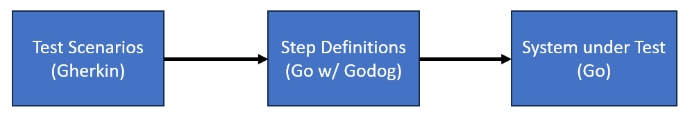

# Welcome
Dear interviewee, 

With this exercise we want to give you the opportunity to demonstrate your problem solving and programming skills. In the exercise you will be using Go lang and Cucumber/Gherkin/GoDog, however, experience in any of those is not required to solve the exercise. A working Git setup and basic Git knowledge is required.

In the interview, you will be asked to present your solution and how you approached the tasks.

We send it to you 24h before our interview and designed this exercise to take about 2 hours.
It is in the best interest of both you and us that you are honest about how easy or difficult this exercise was for you and how much time you actually needed. 
Note that the exercise is not just about getting the right results, but also about your thought process and how you communicate your ideas. Don't feel pressured to invest much more than the intended 2 hours. 

You can choose your favourite editor. We recommend and successfully tested this exercise with Visual Studio Code.

**Good luck!**


# Preparations


## Go lang
If you do not have Go Lang, you need to install it for this exercise
* Follow the official [Go Installation Instructions](https://go.dev/doc/install)
* Follow the instructions for a [Hello World program in Go](https://go.dev/doc/tutorial/getting-started#code)
* **Make sure that you can successfully run your hello world application** using `go run .` in the command line 

## Cucumber and Godog
Do you know Cucumber? It's a framework that enables writing tests in a BDD-style (BDD = Behavior-Driven-Development).
You don't need a deep understanding of BDD or Cucumber for this exercise. However, if you are new to Cucumber you 
may read [this overview](https://cucumber.io/docs/guides/overview/) for some context.

Cucumber tests are written in *Gherkin* syntax. It has a simple structure, focusing on the business case when writing tests. 

*Godog* is the framework for using Cucumber in Golang.

Using Godog/Cucumber, one can write human-readable ***Test Scenarios*** in Gherkin. The test steps are 
linked to ***Step Definitions*** written in Go, which call the application code of your **System Under Test (SUT)**.




We created a **fork of the Godog repository**: https://github.com/slrongji/godog which you will be using in this exercise. 


# Simple Godog example
* Clone the [godog fork](https://github.com/slrongji/godog)
* Create an own branch for your changes
  * Through the exercise, you may commit to your branch to document and save your progress
* In your checkout folder, navigate to `_examples/godogs`
* Run `go test` and inspect the terminal output
* You should see that 4 test Scenarios with 12 steps were executed and passed
* Find the Gherkin .feature-files and take a look. This is where you can define more tests.
  * Add a test that starts with 20 godogs, eats 13, and expects 7 remaining 


## Gherkin Scenario Outlines
* Experiment with Gherkin "Scenario Outlines". They allow you to avoid redundant code in your .feature files
* In file `godogs.feature`, replace the first scenario with an scenario outline:
```
  Scenario Outline: Valid examples for
    Given there are <INITIAL> godogs
    When I eat <EAT>
    Then there should be <REMAINING> remaining

    Examples:
      | INITIAL | EAT | REMAINING |
      | 12      | 5   | 7         |
      | 20      | 10  | 10        |
```
* Rerun the test and confirm that everything works
* Add some more reasonable examples


# HTTP Server Example
* In your checkout folder, navigate to `_examples/api` and open `api.go`
* This is a simple HTTP server with two endpoints, accepting GET requests
* Gherkin tests for both endpoints exist in the `features` folder
  * As before, you can run them with `go test`

## Version endpoint
This endpoint simply returns the go version of the server.
* Start the server (best to use a separate terminal) with `go api.go`
* Run the tests and make the tests for the version endpoint pass.
  * It is likely that you have to adjust the expected test result to match your Go lang installation

## Timestamp endpoint
1) The timestamp endpoint can convert a timestamp like `2023-12-01T10:02:01Z` into other (date-only) formats using two parameters:
    * The timestamp
    * The target format
2) If an empty string is provided as format param, the time should be returned using the original format in the response
3) If an unsupported of wrong format is given, an error should be returned

Supported formats are
```
	"2006-01-02",  // ISO 8601 date format
	"02-Jan-2006", // Common date format
	"Jan 2, 2006", // Another common date format
	"02/01/2006",  // European date format
	"01/02/2006",  // US date format
```

The implementation is based on the [Time.Format go package](https://pkg.go.dev/time)

### Test existing implementation
Requirements 1 and 2 should be implemented already
* Run the tests and assure that all tests pass
* Add 2-3 more test scenarios to provide more coverage 


### Test all valid formats
* Please extend the timestamp endpoint tests to cover all valid formats
* Try to avoid heavily redundant code


### Extend implementation and test it
* Please implement Requirement 3 of the endpoint
  * Extend the HTTP server implementation
  * Use the provided **implementation help** below
  * Assure that everything compiles and you can run the server
* If helpful, you can also use `curl` to query / test your endpoints, e.g.:
  ```sh
  curl "http://localhost:8080/timestamp?time=2023-12-01T10:02:01Z&format=2010-12-14"
  ```
* Extend the timestamp endpoint tests to test requirement 3

#### Implementation help
You can define the valid formats in an array
```Go
var validFormatParams = []string{
	"2006-01-02",  // ISO 8601 date format
	...
}
```

You can use this function to return a valid format based on a given format parameter, and return an error if the format is not supported:
```Go
func getFormat(formatParam string) (string, error) {
	for _, f := range validFormatParams {
		if _, err := time.Parse(f, formatParam); err == nil {
			return layout, nil
		}
	}
	return "", fmt.Errorf("Format given in format parameter not supported: %s", formatParam)
}
```


# Archive / Send in your results
After our interview, for later review, please send us a copy of your results.

Please create a .zip archive of your '_example/api' folder, 
remove the file extension, and try sending it to `simon.eck@dentsplysirona.com`.


